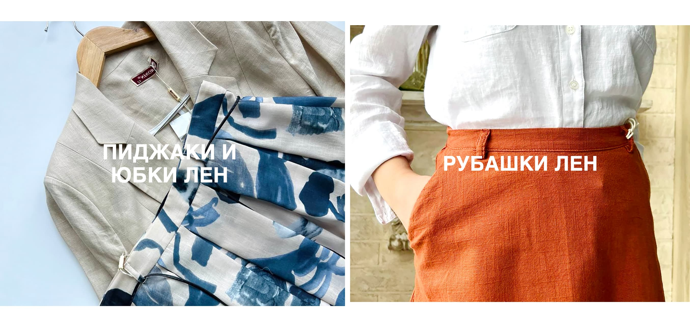
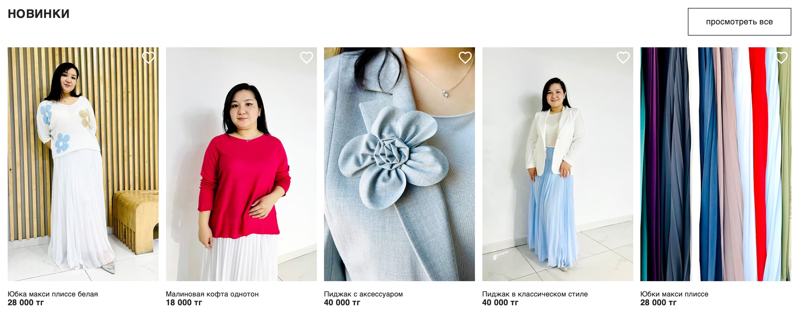
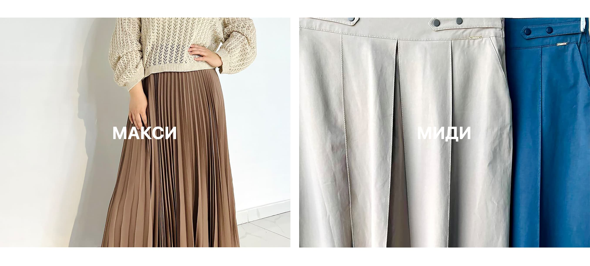
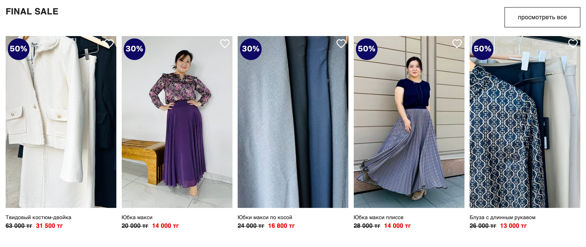

# **La Vie** — сучасний інтернет-магазин жіночого одягу

- **Локація:** Алмати, Казахстан.
- **Фокус:** жіночі спідниці довжини максі та міді.
- **Супутні товари:** блузи, кофтини, пальта.
- **Місія:** залучити жінок до культури носіння спідниць. Про комфорт та красу одночасно, для будь-яких життєвих обставин (робота, прогулянка, час з дітьми чи свято).

## 📂 Структура сайту

### **Основні сторінки**
- **Головна** — презентація бренду та ключових товарів.
- **Каталог** — повний асортимент товарів з можливістю фільтрації.
- **Новинки** — сторінка з останніми новими надходженнями.
- **Sale** — окрема сторінка з товарами зі знижками.
- **Контакти** — інформація для зв’язку з магазином.
- **FAQ** — відповіді на часті питання.

### **Сторінки товарів**
- **Сторінка спідниць (максі)** — підкатегорія товарів з фільтром за типом (максі).
- **Сторінка картки товару** — детальний опис конкретного товару з його характеристиками, фото та кнопками для додавання в корзину.

### **Додаткові функції**
- **Пошук за запитом** — швидкий доступ до товарів за ключовими словами.
- **WhatsApp** — можливість звернутися до служби підтримки.
- **Персональний кабінет** — для зареєстрованих користувачів з історією замовлень.
- **Корзина** — функціонал для перегляду та редагування замовлених товарів.

### **Модальні вікна**
- **Знижки** — повідомлення про актуальні знижки та акції.
- **Реєстрація та вхід** — доступ до особистого кабінету через модальні вікна.
- **Лічильник товарів у корзині** — інформація про кількість доданих товарів.

## 📸 Прев'ю

### Хедер
Лого, основне меню (каталог, новинки, sale, контакти, faq) та випадаюче меню для спідниць, блуз, кофтин та пальт. Свг-іконки з активними посиланнями на WhatsApp, реєстрацію, вхід та пошук товарів.
[Дивитися роботу хедеру](https://vimeo.com/manage/videos/1026673508)

### Секції сайту
- **Секція актуальних колекцій**

- **Секція новинок**

- **Секція актуальних колекцій**

- **Секція популярних**

- **Секція знижок**

- **Футер**

### Відео демонстрації
- **Робота фільтра вибору товару**
[Дивитися роботу фільтра](https://vimeo.com/manage/videos/1026673582)

- **Респонсивно-адаптивний дизайн**
[Дивитися адаптацію](https://vimeo.com/manage/videos/1026673350)

## ✨ Особливості
- Стильний інтерфейс
- Фільтрація товарів за категоріями
- Модальні вікна для клієнтського функціоналу
- Адаптивно-респонсивний дизайн

## 🛠️ Технології
- HTML5
- CSS3
- JavaScript (ES6+)
- Parcel для збірки
- Git для контролю версій

## 🚧 Плани розвитку
- Додавання функції оплати
- Покращення анімацій
- Інтеграція з API для отримання оновлених даних

