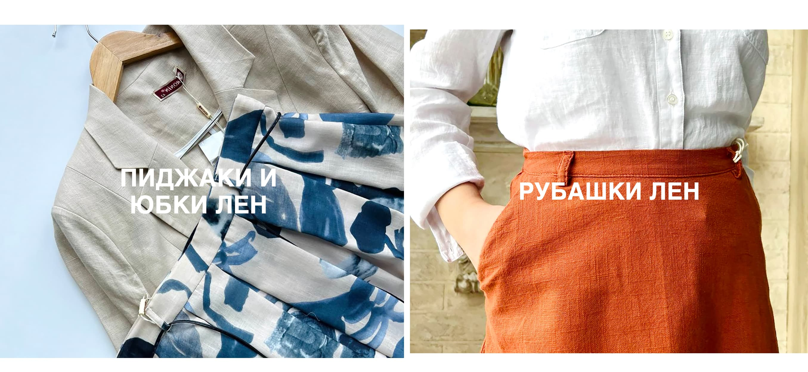
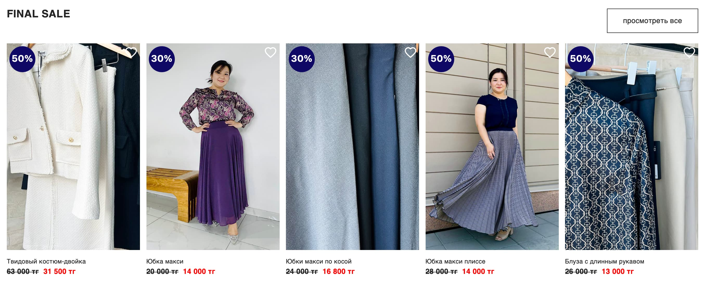

# **La Vie** — a modern online store for women's clothing

- **Location:** Almaty, Kazakhstan.
- **Focus:** maxi and midi length women's skirts.
- **Additional Products:** blouses, sweaters, coats.
- **Mission:** to encourage women to embrace the culture of wearing skirts. Offering comfort and beauty for any life occasion (work, walks, time with children, or celebrations).

## 📂 Website Structure

### **Main Pages**
- **Home** — brand presentation and featured products.
- **Catalog** — full product range with filtering options.
- **New Arrivals** — a page with the latest products.
- **Sale** — a dedicated page with discounted items.
- **Contacts** — contact information for the store.
- **FAQ** — answers to frequently asked questions.

### **Product Pages**
- **Skirts Page (Maxi)** — product subcategory with filters by type (maxi).
- **Product Detail Page** — detailed description of a specific item with characteristics, photos, and add-to-cart buttons.

### **Additional Features**
- **Search by Query** — quick access to products by keywords.
- **WhatsApp** — contact option for customer support.
- **Personal Account** — for registered users with order history.
- **Shopping Cart** — functionality to view and edit items in the cart.

### **Modals**
- **Discounts** — notification about current discounts and promotions.
- **Registration and Login** — access to personal accounts through modals.
- **Cart Item Counter** — information on the number of items added.

## 📸 Preview

### Header
Logo, main menu (catalog, new arrivals, sale, contacts, FAQ), and a dropdown menu for skirts, blouses, sweaters, and coats. SVG icons with active links for WhatsApp, registration, login, and product search.  
[View header functionality](https://vimeo.com/manage/videos/1026673508)

### Website Sections
- **Current Collection Section**  

- **New Arrivals Section**  

- **Current Collection Section**  

- **Popular Items Section**  

- **Discount Section**  

- **Footer**  

### Demonstration Videos
- **Product Filter Functionality**  
[Watch filter functionality](https://vimeo.com/manage/videos/1026673582)

- **Responsive Design**  
[View responsive adaptation](https://vimeo.com/manage/videos/1026673350)

## ✨ Features
- Stylish interface
- Product filtering by category
- Modals for customer functionality
- Responsive design

## 🛠️ Technologies
- HTML5
- CSS3
- JavaScript (ES6+)
- Parcel for bundling
- Git for version control

## 🚧 Development Plans
- Adding payment functionality
- Enhancing animations
- Integration with APIs for updated data
